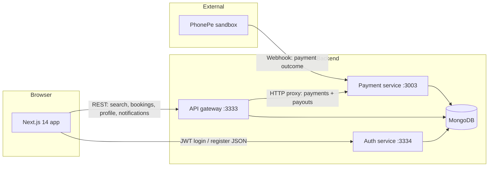
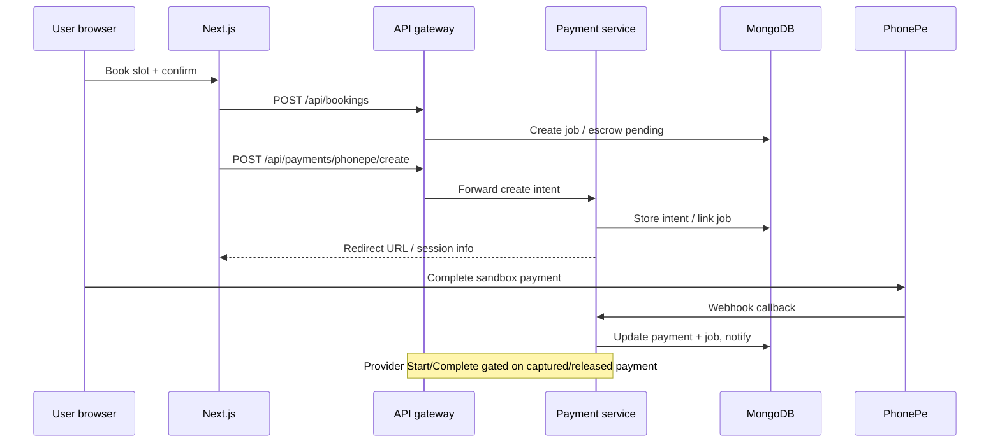

# Workmate Rural Services

**Workmate** is a customer-first marketplace for booking local home services in Kerala. The product pairs a **Next.js** web app with a **MongoDB**-backed backend split into an **API gateway**, **auth service**, and **payment service**. Customers discover providers, pay through **PhonePe (sandbox)**, and track jobs; providers manage availability, jobs, and weekly payouts.

---

## Features

### Platform & experience

- **Responsive UI** with Tailwind-style theming, Material Symbols, and Inter typography (`frontend/app`).
- **Dual-role product**: same deployment serves **customers** and **service providers** with separate sessions.
- **Session model**: customer, provider, and **admin** sessions live in **browser `localStorage`** (`workmate_customer_auth`, `workmate_provider_auth`, `workmate_admin_auth`) with JWT from auth; `AuthProvider` exposes `customerSession`, `providerSession`, `adminSession`, and `activeRole` (**admin** takes precedence when present, then provider, then customer).
- **Post-login redirects**: `/auth` supports `?next=` so flows like “book this provider” return after login.

### Admin (operations)

- **Staff login**: **`/auth/admin`** — separate, minimal sign-in (not shown on the main customer/provider **`/auth`** page). The homepage footer includes a discreet **Staff sign-in** link.
- **Admin dashboard**: **`/admin/dashboard`** — tabbed UI (overview, customers, providers, bookings, reports, settings) backed by **`GET /api/admin/*`** on the gateway (JWT role **`admin`**).
- **Seeded dev admin** (auth-service): on startup in non-production, the default admin password is synced from env; defaults are **`ADMIN_PHONE=9999999999`**, **`ADMIN_PASSWORD=admin123`** unless overridden (see Environment variables).

### Customer

- **Home (`/`)**: hero, service search box, links to search and login/dashboard.
- **Provider search (`/search`)**: live results from `GET /api/providers/search` with filters — text query, location, category (e.g. Plumbing / Electrical / Carpentry), price band, minimum rating, **available today**, **weekends**, pagination; shows **Online now** when `isOnline` is true.
- **Navigation**: logged-in customers see **My Dashboard** in the header where configured; **Home** is de-emphasized in places to reduce accidental navigation away from tasks.
- **Profile / booking (`/profile`)**:
  - **Without `providerId`**: **My Account** — load/save profile via `GET/PATCH /api/customers/:uid/profile` (name, phone, location, language, SMS/WhatsApp/push preferences).
  - **With `providerId`**: choose service name, date, time → **create booking** → **start PhonePe payment session** via gateway proxy; guests are sent to `/auth` with `next` preserved.
- **Customer dashboard (`/dashboard`)**: booking list with **payment status**, **status filters** (all / requested / active / completed), **cancel** via `PATCH /api/bookings/:jobId/status`, **notification bell** with unread count and **mark read**.

### Provider

- **Provider dashboard (`/provider/dashboard`)**: gated by provider session; redirects to `/auth?role=provider` if missing.
- **Go Online / Go Offline**: persists `PATCH /api/providers/:providerUid/availability` so search ranking and “online” badges stay accurate.
- **Job queue**: incoming bookings with **Accept / Reject (Decline)** for `requested` jobs.
- **Payment-gated progression**: **Start** and **Complete** stay disabled until escrow/payment is **`captured`** or **`released`** (copy explains waiting for customer payment).
- **Payouts**: summary widgets and **payout history** from payment-service APIs (weekly batch, reconciliation).
- **Notifications**: same pattern as customers (list + unread + mark read); sidebar focused on provider tasks (no generic customer marketplace clutter).

### Payments & escrow

- **PhonePe sandbox**: create intent via gateway → payment-service; **webhook** updates job payment state (`PAYMENT_SUCCESS` / `PAYMENT_ERROR` paths).
- **Weekly provider payouts**: `POST /api/payouts/weekly/run` (proxied); batches eligible completed/captured work; provider-facing history and summary endpoints.

### In-app notifications (MongoDB)

Persisted notifications and **GET/PATCH** APIs on the gateway. Typical triggers:

- Provider **online/offline** toggle.
- **New booking** and **booking status** changes.
- **Payment captured/failed** (from payment-service webhook).
- **Weekly payout** line items / batch completion.

---

## Architecture

### Runtime components

| Piece | Role | Default URL / port (local) |
| --- | --- | --- |
| **Next.js app** | UI, client-side API calls, auth session storage | `http://localhost:3000` (`/auth`, `/auth/admin`, `/admin/dashboard`, …) |
| **API gateway** | Bookings, search, profiles, availability, notifications; **proxies** payment/payout HTTP to payment-service | `http://localhost:3333` |
| **Auth service** | Register/login, JWT issuance | `http://localhost:3334` |
| **Payment service** | PhonePe create + webhook, escrow/job payment fields, payout batches, writes payment-related notifications | `http://localhost:3003` |
| **MongoDB** | Single database shared by all services (`d4dent`) | `mongodb://localhost:27017` (Docker uses admin credentials — see compose) |

Docker Compose (`docker-compose.local.yml`) runs **MongoDB**, **api-gateway**, **auth-service**, and **payment-service**. The gateway’s **`PAYMENT_SERVICE_URL`** points at the payment container (e.g. `http://payment-service:3003`).

### System diagram

How the browser and services connect:



### Typical request paths

- **Auth-only**: browser → **auth service** (`NEXT_PUBLIC_AUTH_API_URL`, default `http://localhost:3334`) for `POST /api/auth/register` and `POST /api/auth/login`.
- **Domain data**: browser → **API gateway** (`NEXT_PUBLIC_API_URL`, default `http://localhost:3333`) for providers, customers, jobs, notifications, and **admin metrics** (`/api/admin/*`) when logged in as admin.
- **Payments/payouts from UI**: browser → **gateway** (`/api/payments/*`, `/api/payouts/*`) → **payment service** (server-side proxy preserves one public API surface).

### Booking & payment flow (high level)



---

## Technology stack

| Layer | Choices |
| --- | --- |
| Frontend | Next.js 14, React 18, client components, Tailwind (CDN) |
| API | Express on Node (gateway, auth, payment) |
| Data | Mongoose models in `backend/libs/data-access` (users, jobs, escrow, payouts, notifications) |
| Local infra | Docker Compose, MongoDB 6 |

---

## Local run

### 1) Backend (Docker)

From repo root:

```bash
docker compose -f docker-compose.local.yml up -d --build
```

### 2) Frontend

From `frontend/app`:

```bash
npm run dev
```

### 3) URLs

- App: `http://localhost:3000`
- API health: `http://localhost:3333/health`
- Auth health: `http://localhost:3334/health`
- Payment health: `http://localhost:3003/health`

Optional smoke test (Git Bash / macOS / Linux): `./test-local.sh`

---

## API reference

### Auth service (`:3334`)

- `POST /api/auth/register`
- `POST /api/auth/login`
- `GET /health`

### API gateway (`:3333`)

- `GET /api/admin/overview` · `GET /api/admin/customers` · `GET /api/admin/providers` · `GET /api/admin/bookings` · `GET /api/admin/reports` — **require JWT role `admin`**
- `GET /api/providers/search` — includes `isOnline`; online providers rank higher; **available today** can match online providers.
- `GET /api/providers/:providerUid/availability`
- `PATCH /api/providers/:providerUid/availability` — body `{ "isOnline": true|false }`
- `GET /api/customers/:customerUid/profile`
- `PATCH /api/customers/:customerUid/profile`
- `GET /api/notifications/:recipientUid?role=customer|provider&limit=…`
- `PATCH /api/notifications/:notificationId/read`
- `POST /api/bookings`
- `GET /api/bookings/customer/:customerUid`
- `GET /api/bookings/provider/:providerUid`
- `PATCH /api/bookings/:jobId/status`
- `POST /api/payments/phonepe/create` *(proxy)*
- `POST /api/payments/phonepe/webhook` *(proxy)*
- `GET /api/payments/bookings/:jobId/status` *(proxy)*
- `POST /api/payouts/weekly/run` *(proxy)*
- `GET /api/payouts/provider/:providerUid` *(proxy)*
- `GET /api/payouts/provider/:providerUid/summary` *(proxy)*
- `GET /health`

### Payment service (`:3003`)

Same payment and payout routes as implemented in code (gateway proxies for a single entrypoint from the browser).

---

## Project structure

```text
d4dent-rural-services/
├── frontend/app/                  # Next.js UI
├── backend/apps/
│   ├── api/                       # API gateway
│   ├── auth-service/              # Auth
│   └── payment-service/           # PhonePe + payouts
├── backend/libs/data-access/      # Shared Mongoose models
├── docker-compose.local.yml
├── Dockerfile.api-gateway
├── Dockerfile.auth-service
├── Dockerfile.payment-service
└── README.md
```

---

## Environment variables (local)

Copy `.env.local.example` and adjust.

| Area | Variables |
| --- | --- |
| API / DB | `MONGODB_URI`; gateway: `PAYMENT_SERVICE_URL` (Docker: `http://payment-service:3003`) |
| Internal service auth | `INTERNAL_SERVICE_TOKEN` (same value in gateway and payment-service) |
| PhonePe sandbox | `PHONEPE_MERCHANT_ID`, `PHONEPE_SALT_KEY`, `PHONEPE_SALT_INDEX`, `PAYMENT_CALLBACK_BASE_URL` |
| Frontend | `NEXT_PUBLIC_API_URL` (default `http://localhost:3333`), `NEXT_PUBLIC_AUTH_API_URL` (default `http://localhost:3334`) |
| Auth / admin seed | `ADMIN_PHONE`, `ADMIN_PASSWORD`, `ADMIN_NAME` (auth-service; optional overrides for seeded admin) |

Most `/api/*` routes on gateway now require `Authorization: Bearer <jwt>` except public search/health and payment webhook relay.

After changing gateway or payment code, rebuild:

```bash
docker compose -f docker-compose.local.yml up -d --build api-gateway payment-service
```

---

## Troubleshooting

### Blank page / 500 on `/_next/*` in dev

```bash
cd frontend/app
rm -rf .next
npm run dev
```

Windows PowerShell: `Remove-Item -Recurse -Force .next` then `npm run dev`.

### Port 3000 in use

```powershell
netstat -ano | findstr :3000
taskkill /PID <PID> /F
```

### Recreate backend containers

```bash
docker compose -f docker-compose.local.yml up -d --build --force-recreate
```

---

## Payment validation scenarios

- Booking → PhonePe intent → webhook `PAYMENT_SUCCESS` → booking payment moves toward **captured** (UI shows paid/progression enabled).
- Booking → webhook `PAYMENT_ERROR` → payment returns to **pending** / failed path.
- Weekly payout run aggregates eligible **completed** jobs with captured payments; batch marks jobs **released** and surfaces in provider payout history.

---

## Agent / Nx notes

`AGENTS.md` contains Nx-oriented guidance for this workspace (generators, task running). Prefer `nx` for monorepo tasks when Nx is installed.
